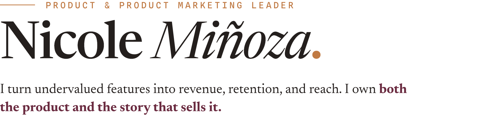
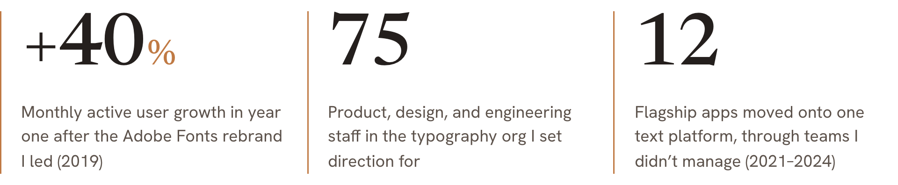

<picture>
  <source media="(prefers-color-scheme: dark)" srcset="assets/readme/banner-e-dark.png">
  
</picture>

I lead at the intersection of product, product marketing, and market strategy, turning complex technology into products people understand, adopt, and value.  

I spent seven years leading product at Adobe after a decade in product marketing, most recently as Director of Product for the fonts and typography business. My work spans AI and machine learning, platform strategy, positioning, go-to-market, and adoption across complex product ecosystems.  

I’m exploring Director and VP roles in Product and Product Marketing, especially where product complexity, customer understanding, and adoption intersect. [Reach me on LinkedIn](https://www.linkedin.com/in/nicoleminoza) ↗

## Selected Work

- [**Type Default Audit**](https://nicoleminoza.com/type-default-audit/) ↗  
  Independent research on what frontier AI models recommend when designers ask for type. Across 1,890 controlled calls to Claude, ChatGPT and Gemini, the models named 1,029 typefaces, and forty of them carried half the answers. The result is a reusable baseline for evaluating AI font-discovery systems, and a way to see which choices AI makes visible by default. [Source](https://github.com/nicoleminoza/type-default-audit)
- [**House Style**](https://housestyle.nicoleminoza.com/) ↗  
 A curated AI workflow product for marketing, brand, and product leaders. The library stays open; sign-in is earned through saved work and interactive builders, with product bets instrumented in PostHog. [Source](https://github.com/nicoleminoza/house-style)
- [**How Institutions Behave**](https://nicoleminoza.com/how-institutions-behave/) ↗  
  An interactive brand thesis testing the idea that brand is behavior, not image, against nine landmark cultural-institution rebrands. I researched, positioned, designed, and built the project end to end. [Source](https://github.com/nicoleminoza/the-behavioral-brand)

## At Adobe

Most recently Director of Product Management at Adobe, leading typography and AI product strategy across a 75-person organization. My final launch was generative text editing in Firefly Boards at Adobe MAX 2025.

<picture>
  <source media="(prefers-color-scheme: dark)" srcset="assets/readme/stats-e-dark.png">
  
</picture>

I founded [Make It Land](https://makeitland.studio), a positioning-led brand and web studio where I work with founder-led businesses on positioning, messaging, and digital expression.

## Connect

[Résumé ↗](https://nicoleminoza.com/resume.html) · [nicoleminoza.com](https://nicoleminoza.com) · [hello@nicoleminoza.com](mailto:hello@nicoleminoza.com)
